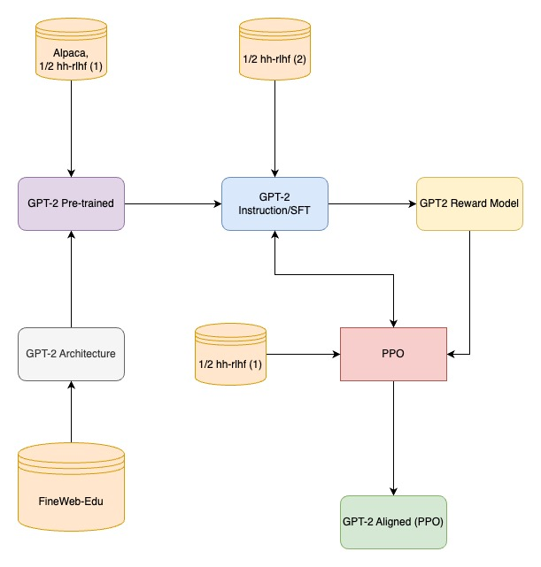

# TinyChatGPT

This project investigates the feasibility of applying Rein-forcement Learning from Human Feedback (RLHF) align-ment to smaller language models, specifically focusing on a 124M parameter GPT-2 model. The primary objective is to evaluate whether alignment techniques, commonly employed in large models such as ChatGPT, can be ef-fectively adapted to smaller models, thereby enhancing their conversational quality and user alignment. The project pipeline involves pre-training a small GPT-2 model on the FineWeb-Edu dataset, followed by supervised fine-tuning using the Alpaca and Anthropic HH-RLHF datasets. Subsequent stages include reward model training and fine-tuning with Proximal Policy Optimization (PPO). The model's performance was evaluated using the Awe-some ChatGPT Prompts dataset to measure the effective-ness of RLHF training. The results demonstrate that RLHF alignment can significantly enhance response quality in smaller models.

Each training stage of the pipeline corresponds to individual script like pretrain_gpt2, sft_instructions.ipynb, reward_model.ipynb, ppo_model.ipynb respectively. Final evaluation using ChatGPT-4o-mini is done in the eval.ipynb file. Each file needs to be run in the above mentioned order to get the required models.
